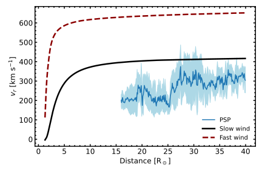

THIS README NEEDS TO BE REFORMATED TO ACCOUNT FOR THE POSSIBLE INCLUSION OF SPAN-I DATA!

# SWEAP/SPC data evaluation

The github repository of this code does not provide the  [measurement data](http://sweap.cfa.harvard.edu/Data.html "SWEAP data"). that is evaluated. For the purposes of the connected paper ([Kasper et al., 2016](https://link.springer.com/article/10.1007/s11214-015-0206-3 "Kasper et al., 2016")), several encounter phases of PSP
are evaluated:
- **ENCOUNTER 07:** 01-12-2021 to 01-23-2021, Perihelion ~ 0.090 Rs
- **ENCOUNTER 08:** 04-24-2021 to 05-04-2021, Perihelion ~ 0.076 Rs
- **ENCOUNTER 09:** 08-04-2021 to 08-15-2021, Perihelion ~ 0.076 Rs

The data is reduced according to the conservative boundaries of the [SWEAP User Guide](http://sweap.cfa.harvard.edu/sweap_data_user_guide.pdf "SWEAP User Guide") (`general_flag=0`), sorted into radial distance bins congruent with the radial cell size of the connected NIRVANA simulations (`dr = 0.1 R_s`), treated with a mean/stddev and median/quartiles evaluation and compared to a radial outline of the simulation results.

## Structure
The code execution routine can be read in the bash-script `evaluation_run.sh`. It sets the size of the radial bins as a global variable and then:
1. `data_eval.py`: Reads in the observational data files, sortes ALL data into distance bins and writes data file for each distance bin into `STATISTICS/BINNED_DATA`
2. `binnded_stats.py`: Takes all files in previously mentioned folder and creates a new file, `PSP_statistics.dat`, with mean+stddev and median+q1/q3 for each major parameter and distance bin. Also creates bar charts for each major parameter and distance bin
3. `ingress_egress.py`: Similar as above, but the data is split between ingress and egress phase for each encounter
4. `observation_plots.py`: Creates median+stddev and mean+q1/q3 plots for all three major parameters
5. `comparison_plots.py`: Collects the evaluated measurement data and creates plots together with a radial profile of the simulation results.

Be aware that the `binned_stats.py` routine creates three (3) histograms per distance bin, which can result in a large number of files. These plots are generated in `PLOTS/BinHistrograms` but are not included in this repository

## Selected Results
The plot below illustrates the evaluated SPC measurements from Encounters 7, 8 and 9, both for individual ingress and egress phases (top row) as well as mean and standard deviation parameters (bottom row).

Comparing the measurement data to the simulated solar wind results, the bimodal structure of the simulations becomes visible.

